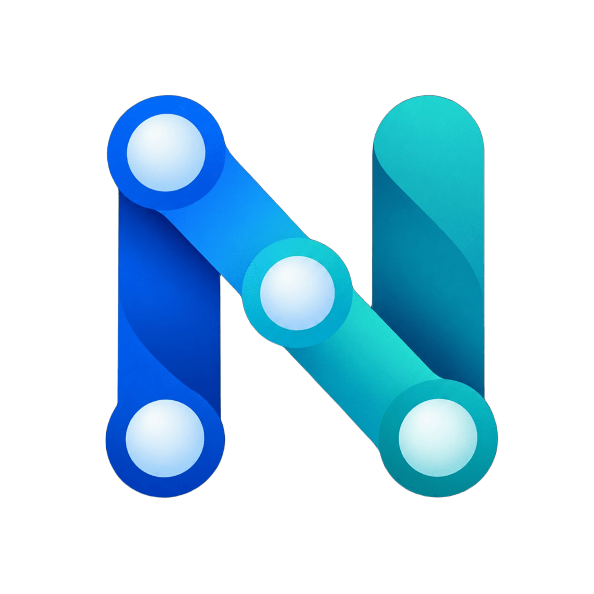

<div align="center">


# Nexum · Scientific Workbench

### Da equação à descoberta.

Química computacional, estruturas 3D e experimentos em uma bancada nativa para Windows e Linux.


<!-- nexum-catalog:start -->
**43 calculadoras · 12 áreas científicas · 10 bancadas · 5 ferramentas de análise de dados**
<!-- nexum-catalog:end -->

[Instalar no Windows](#começar-no-windows) · [Instalar no Fedora](#começar-no-fedora) · [Experimentos](#uma-bancada-que-responde-aos-seus-dados) · [Motor científico](#o-cérebro-científico) · [Documentação](#documentação)

</div>

---

## Química em uma bancada integrada

O **Nexum Scientific Workbench** reúne cálculos químicos, visualização molecular 3D e experimentos computados em uma aplicação nativa com **GTK4, libadwaita e OpenGL**. A interface organiza o trabalho em Início, Calculadoras, Estruturas 3D, Experimentos, Análise e Histórico.

A ideia central é simples: **você fornece as condições; o motor resolve o modelo; a bancada mostra o estado calculado.** Presets preenchem entradas. As equações determinam os resultados.

| Calcule | Explore | Experimente |
| :--- | :--- | :--- |
| Estequiometria, equilíbrio, termodinâmica, cinética e outras áreas, com gráficos nas ferramentas que os implementam. | Moléculas e macromoléculas, fitas com espessura, profundidade, ligantes e diferentes representações. | Titulação, eletroquímica, calorimetria e outras bancadas com medições e curvas ligadas ao mesmo estado. |

Os cálculos são locais. A instalação e a busca de estruturas em **PubChem/RCSB** precisam de conexão. Os módulos científicos avançados também podem ser usados diretamente em Python; nem todos possuem formulário próprio na interface.

> **Nexum 6.8 · Windows e Linux:** aplicação desktop nativa com o mesmo motor científico, calculadoras, bancadas e visualizador molecular. A versão Windows funciona sem WSL.

## Novidades da versão 6.8

- **Logo oficial:** `docs/logo-nexum.svg`, usado no aplicativo, no instalador e nos atalhos.
- **Visualização:** contornos adaptados ao fundo na camada de van der Waals; medições de distância, ângulo e diedro; seleção por grupos, cadeias e resíduos; 2D vinculado ao 3D; cargas empíricas Gasteiger quando a conectividade permitir.
- **Superfícies:** van der Waals, acessível ao solvente e SES aproximada por grade; corte e transparência; importação de densidade/orbitais Cube e mapeamento de potencial fornecido pelo usuário.
- **Análise:** espectros CSV, integração, correção de base sem alterar o original, calibração com incerteza, comparação cinética com resíduos/AIC, titulação poliprótica e padrões isotópicos.
- **Processos:** combustão, CSTR/PFR, perda de carga em tubos, troca térmica e resolução cromatográfica.
- **Sessões e figuras:** salvar/restaurar estruturas, câmera, camadas, entradas, resultados, experimentos e anotações; comparação de estruturas; PNG de alta resolução e gráficos SVG/PDF.

Os modos vibracionais são importados de cálculos e animados em velocidade didática. O programa não calcula orbitais ab initio nem deduz identidade química de um espectro. Consulte [o guia de análise](docs/ANALISE-E-VISUALIZACAO.md) para formatos, limites e exemplos.

### Instalação empacotada

O workflow **Build desktop installers** produz um instalador Windows `.exe` e um pacote Linux `.flatpak`. Os artefatos da PR exigem acesso ao repositório e possuem prazo de retenção. No Linux: `flatpak install --user Nexum-x86_64.flatpak`; depois, `flatpak run io.github.nexum.ScientificWorkbench`.

**Atalho no Linux:** após instalar o Flatpak, procure **Nexum** no menu de aplicativos e fixe-o nos favoritos, se desejar. Se ele abrir pela loja, mas não aparecer no menu, o ZIP do pacote inclui `Reparar-atalho-Nexum.sh`: execute `bash Reparar-atalho-Nexum.sh` na pasta extraída. Ele restaura o atalho e o logo no menu do usuário, preservando uma cópia de um atalho anterior diferente. Caso o menu ainda não atualize, saia da sessão e entre novamente. Isso não exige reinstalar dependências de desenvolvimento.

As instruções abaixo são para execução a partir do código e desenvolvimento.

## Começar no Windows

**Requisitos:** Windows 10/11 de 64 bits, driver com suporte a **OpenGL 3.3** e conexão para instalar as dependências.

1. Instale [MSYS2](https://www.msys2.org/) na pasta padrão `C:\msys64` e [Python 3.12 x64](https://www.python.org/downloads/windows/), incluindo o launcher `py`. Se tiver WinGet, pode usar o Terminal:

   ```powershell
   winget install --exact --id MSYS2.MSYS2
   winget install --exact --id Python.Python.3.12
   ```

2. [Baixe o projeto em ZIP](https://github.com/darimarchive-glitch/Nexum-Scientific-Workbench/archive/refs/heads/main.zip), clique com o botão direito e escolha **Extrair tudo**. Use uma pasta gravável, como `Documentos\Nexum`.
3. Após instalar os pré-requisitos, abra **`install-windows.cmd`** na pasta extraída. Aguarde a instalação, o diagnóstico e os testes.
4. Abra **`run-windows.cmd`** ou o atalho **Nexum** criado na Área de Trabalho.

O instalador prepara GTK4/libadwaita, as bibliotecas científicas e o suporte 3D. Ele verifica a leitura mmCIF, a geração de conformadores, o histórico SQLite e a renderização antes de concluir. A distribuição usa o código-fonte com dependências instaladas; **não é um `.exe` independente**.

| Arquivo | O que faz |
| :--- | :--- |
| `install-windows.cmd` | Instala dependências, executa diagnóstico e testes e cria o atalho. |
| `run-windows.cmd` | Abre o aplicativo. |
| `test-windows.cmd` | Executa o diagnóstico completo e a suíte de testes. |
| `diagnose-windows.cmd` | Verifica dependências, química, SQLite e OpenGL. |
| `install-windows-shortcut.cmd` | Recria o atalho na Área de Trabalho. |

**Dados locais:** histórico em `%LOCALAPPDATA%\Nexum\history.sqlite3` e cache de estruturas em `%LOCALAPPDATA%\Nexum\Cache\structures`. Atualizar o código não apaga o histórico.

Se a atualização do próprio MSYS2 encerrar a instalação, execute `install-windows.cmd` novamente. Se ocorrer outro erro, a janela permanece aberta para mostrar a mensagem. Caminhos personalizados, reinstalação e diagnóstico estão no [guia completo para Windows](docs/WINDOWS.md).

## Começar no Fedora

Em uma sessão gráfica do Fedora, com Git instalado:

```bash
git clone https://github.com/darimarchive-glitch/Nexum-Scientific-Workbench.git nexum-gnome
cd nexum-gnome
chmod +x *.sh
./install-fedora.sh
./run.sh
```

O instalador usa `dnf` ou `dnf5`, solicita `sudo` para instalar as dependências nativas, cria um ambiente `.venv` com acesso aos pacotes GTK do sistema, instala as bibliotecas Python e executa a suíte de testes.

| Comando | O que faz |
| :--- | :--- |
| `./install-fedora.sh` | Prepara dependências e ambiente Python; executa os testes. |
| `./run.sh` | Abre a aplicação nativa. |
| `./test.sh` | Executa os testes e verifica a compilação dos módulos Python. |
| `./install-desktop-shortcut.sh` | Adiciona o Nexum ao menu de aplicativos. |

**Dependências:** Python 3, PyGObject, GTK4, libadwaita, Mesa/OpenGL, NumPy, SciPy, PyOpenGL, gemmi e RDKit. As faixas de versões das bibliotecas Python estão em [requirements.txt](requirements.txt); os pacotes do sistema estão no [instalador](install-fedora.sh). A validação automatizada desta publicação usou Python 3.12.

## Uma bancada que responde aos seus dados

Na v6.6, configuração, desenho e gráfico compartilham uma sessão experimental. Você pode pausar, avançar um passo, explorar um instante ou editar os parâmetros para construir outro cenário.

| Bancada | O que você explora | Base do cálculo |
| :--- | :--- | :--- |
| **Titulação** | Adição de titulante, indicador, curva de pH e equivalência. | Ácido forte ou monoprótico fraco com base forte; balanços de matéria e carga, equilíbrio ácido e autoionização da água. |
| **Célula de Daniell** | Consumo de espécies, massas depositadas e potencial reversível. | Carga elétrica, lei de Faraday e Nernst. |
| **Calorimetria elétrica** | Aquecimento e perdas térmicas para o ambiente. | Balanço de energia com potência e troca térmica. |
| **Equilíbrio de Haber** | Composição inicial e composição de equilíbrio. | Constante dependente da temperatura e extensão de reação no modelo ideal. |
| **Beer–Lambert** | Absorbância, caminho óptico e transmissão. | `A = εbc` e `T = 10⁻ᴬ`. |
| **Cinética** | Conversão de A em B e marcações de meia-vida. | Lei temporal de primeira ordem. |
| **Decaimento nuclear** | População esperada, atividade e meias-vidas. | Decaimento exponencial. |
| **Gás ideal** | Compressão e expansão isotérmicas. | `pV = nRT`. |

**Para começar:** escolha Titulação, altere as concentrações e use **Ir à equivalência**. Depois explore a curva com o controle de tempo. O indicador muda a representação da cor, mantendo o pH calculado pelo modelo.

A velocidade de reprodução controla o relógio visual. **Haber e Beer–Lambert são bancadas estáticas**, atualizadas ao editar os parâmetros. Cores e movimentos esquemáticos ajudam a interpretar o estado. Consulte as hipóteses em [Experimentos v6.6](EXPERIMENTOS-v6.6.md).

## Estruturas com profundidade

O visualizador combina `Gtk.GLArea`, depth buffer, perspectiva e geometria OpenGL. As fitas de macromoléculas são geradas como malhas com espessura.

- **Fontes:** busca em PubChem e RCSB; leitura de SDF, PDB e PDBx/mmCIF no núcleo.
- **Representações:** fitas, bolas e ligações, preenchimento, varetas, backbone e linhas.
- **Inspeção:** cadeias, ligantes, hidrogênios, névoa e perspectiva.
- **Conformadores:** quando não há 3D disponível no PubChem, o fluxo tenta gerar coordenadas com RDKit, ETKDG e otimização MMFF/UFF.

Experimente pesquisar **`4HHB`**, selecionar **RCSB** e usar **Fitas** para explorar a hemoglobina. A disponibilidade depende do serviço remoto; um conformador gerado computacionalmente é uma aproximação do método utilizado.

## O cérebro científico

O registro público `ScientificEngine` reúne modelos reutilizáveis com entradas, equações, hipóteses e domínio declarado. Uma chamada a `solve()` executa o solver e devolve um `CalculationTrace` com resultado, tempo de execução e diagnósticos disponíveis para aquele modelo.

| Área | Implementações no backend | Diagnósticos e escopo |
| :--- | :--- | :--- |
| **Soluções** | Força iônica, Debye–Hückel, Davies e especiação poliprótica. | Balanço de carga e domínio dos modelos de atividade. |
| **Equilíbrio** | Constantes de formação e equilíbrio multirreacional ideal. | Resíduos de balanço e afinidade química. |
| **Gases e fases** | Peng–Robinson puro/misturas, `kij`, fugacidades, Rachford–Rice e flash TP. | Fechamento material e igualdade de fugacidades. |
| **Cinética** | Redes de ação das massas e integração ODE, incluindo BDF. | Avaliações do solver e invariantes estequiométricos. |
| **Eletroquímica** | Butler–Volmer, inversão, polarização com queda `iR` e Cottrell. | Convenções de sinal e hipóteses de cinética/difusão. |
| **Metrologia** | GUM, Monte Carlo e regressão ponderada. | Sensibilidades, covariância, resíduos e `χ²`. |
| **Espectroscopia** | Beer–Lambert multicomponente por LS/NNLS. | Espectro reconstruído, RMSE, posto e condicionamento. |

### Use o motor diretamente em Python

Na raiz do projeto, com as dependências científicas instaladas:

```python
from nexum.core.engine import default_engine

engine = default_engine()

# Três comprimentos de onda, duas espécies e caminho óptico de 1 cm.
# ε em L mol⁻¹ cm⁻¹; absorbâncias adimensionais.
trace = engine.solve(
    "multicomponent-beer",
    absorbance=[0.12, 0.21, 0.15],
    epsilon_matrix=[[100, 10], [10, 100], [50, 50]],
    path_cm=1.0,
)

print(trace.result["concentrations_m"])  # ≈ [0.001, 0.002] mol/L
print(trace.diagnostics)                # RMSE e número de condição
print(engine.keys())                   # Modelos registrados
```

O [exemplo completo](examples/beer_multicomponente.py) pode ser executado após a instalação, a partir da raiz do projeto.

No Windows, pelo PowerShell:

```powershell
.\.venv-science\Scripts\python.exe -m examples.beer_multicomponente
```

No Fedora:

```bash
.venv/bin/python -m examples.beer_multicomponente
```

Esse exemplo foi executado nesta publicação e recuperou as concentrações com erro residual próximo da precisão de ponto flutuante. O trace registra equações declaradas e diagnósticos retornados; ele não representa uma derivação simbólica automática nem um histórico completo das iterações internas.

## Validação e limites científicos

**A suíte contém 179 testes.** Na [validação automatizada da adaptação Windows](https://github.com/darimarchive-glitch/Nexum-Scientific-Workbench/actions/runs/34487381888), o commit `ade6fa1` obteve:

| Ambiente | Resultado |
| :--- | :--- |
| Windows com GTK/Cairo e Mesa | **179 aprovados, nenhum ignorado.** |
| Backend CPython 3.12 no Windows | 167 aprovados; 12 ignorados por ausência de GTK/Cairo. |
| Backend CPython 3.12 no Ubuntu | 167 aprovados; 12 ignorados por ausência de GTK/Cairo. |

A etapa desktop também instalou as dependências em uma pasta com espaços, compilou os shaders, abriu a janela completa, renderizou uma molécula, criou o atalho e repetiu o diagnóstico pelo lançador CMD. O contexto gráfico foi **OpenGL 4.6 Core Profile com Mesa 26.0.3 por software**.

Os testes cobrem cálculos, conservação, benchmarks, mudanças de entradas, sessões experimentais, renderização Cairo, integração GTK, comunicação com RDKit/gemmi e persistência do histórico. Testes `skipped` não contam como aprovados. O diagnóstico registrou avisos GObject no encerramento, sem falha da execução. A verificação manual com GPU física, buscas remotas e escalas de tela 100%, 150% e 200% continua pendente.

Consulte o [escopo de validação Windows](docs/VALIDACAO-WINDOWS.md) e o [registro da publicação original no Fedora](docs/VALIDACAO-PUBLICACAO.md), que documenta a suíte anterior de 170 testes.

Precisão numérica e adequação física precisam ser avaliadas juntas. O projeto declara limites relevantes:

- **Flash Peng–Robinson:** ainda sem teste global completo de estabilidade por plano tangente.
- **Atividades:** Davies e Debye–Hückel têm domínio restrito; convergência não garante validade em soluções concentradas.
- **Cinética:** mecanismos e parâmetros devem ser fornecidos; a rede não é inferida automaticamente.
- **Metrologia:** Monte Carlo usa entradas normais multivariadas; regressão ponderada não trata incerteza em `x`.
- **Pesquisa:** Pitzer/SIT parametrizado, DFT e transporte eletroquímico acoplado não fazem parte desta entrega.

## Organização do projeto

| Caminho | Responsabilidade |
| :--- | :--- |
| [`nexum/core/`](nexum/core/) | Calculadoras, química, estruturas, experimentos e sessões. |
| [`nexum/core/advanced/`](nexum/core/advanced/) | Solvers científicos e registro auditável, independentes de GTK. |
| [`nexum/ui/`](nexum/ui/) | Interface GTK, renderização OpenGL e desenhos/gráficos Cairo. |
| [`nexum/history.py`](nexum/history.py) | Histórico local em SQLite. |
| [`nexum/paths.py`](nexum/paths.py) | Pastas de dados e cache por sistema operacional. |
| [`nexum/chemistry_worker.py`](nexum/chemistry_worker.py) | Integração local com RDKit/gemmi no ambiente Windows. |
| [`scripts/windows/`](scripts/windows/) | Instalação, execução, diagnóstico e atalho no Windows. |
| [`tests/`](tests/) | Testes científicos, numéricos e de interface. |
| [`examples/`](examples/) | Exemplos de uso programático. |

## Licença

Distribuído sob a [licença MIT](LICENSE), conforme definida pelo mantenedor neste repositório.

## Documentação

| Documento | Para que serve |
| :--- | :--- |
| [Windows](docs/WINDOWS.md) | Instalação, execução, dados locais e solução de problemas. |
| [Validação Windows](docs/VALIDACAO-WINDOWS.md) | Escopo dos testes e verificações manuais pendentes. |
| [Experimentos v6.6](EXPERIMENTOS-v6.6.md) | Controles, leitura das bancadas e limites de cada modelo. |
| [Arquitetura do backend](BACKEND-ARCHITECTURE.md) | Contratos, solvers, traces e separação da interface. |
| [Auditoria científica](SCIENTIFIC-AUDIT.md) | Hipóteses, equações e decisões de modelagem. |
| [Matriz de validação](VALIDATION-MATRIX.md) | Escopo e verificações científicas documentadas. |
| [Design da interface](UI-DESIGN.md) | Organização e linguagem visual. |
| [Changelog](CHANGELOG.md) | Evolução do projeto. |
| [Contribuição](CONTRIBUTING.md) | Como propor melhorias e relatar problemas reproduzíveis. |

---

<div align="center">



**Nexum Scientific Workbench · Windows e Linux · 6.8**

*Entradas explícitas. Modelos declarados. Resultados calculados.*

© 2026 [Davi P. Souza](https://github.com/darimarchive-glitch) – Nexum Scientific Workbench
</div>

