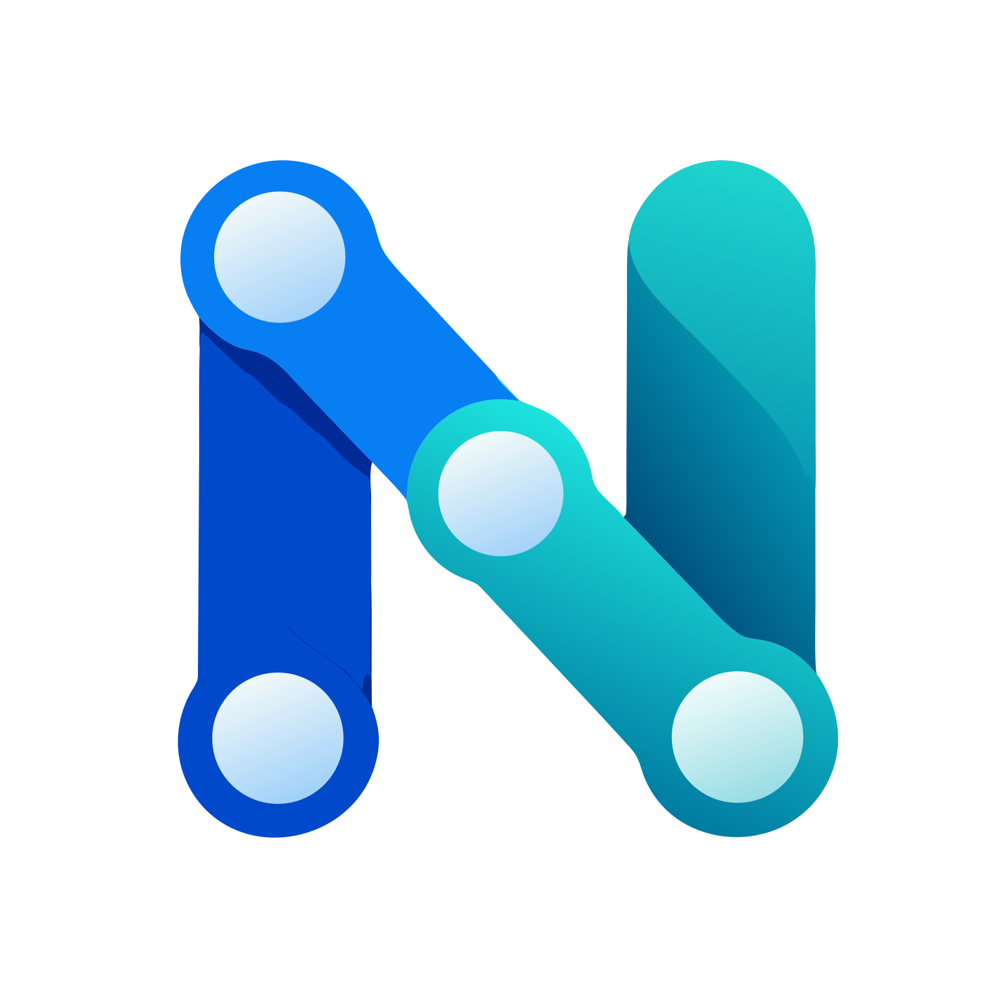

<div align="center">


# Nexum

**Scientific Workbench — explore a química, compreenda o modelo, examine o resultado.**

Versão **7.0.0-preview.2** · aplicação desktop · interface em português brasileiro
</div>

<!-- nexum-catalog:start -->
**43 calculadoras · 12 áreas científicas · 10 bancadas · 5 ferramentas de análise de dados · 16 recursos de laboratório**
<!-- nexum-catalog:end -->

Este pacote contém o projeto atualizado e os procedimentos de compilação. É uma **prévia de desenvolvimento**: os testes automatizados e as limitações efetivamente verificadas estão em [Validação](docs/development/validation.md). Os instaladores da preview.2 passaram pela compilação e pelos testes nativos em Windows, Linux e macOS e estão disponíveis em [Releases](https://github.com/darimarchive-glitch/Nexum-Scientific-Workbench/releases/tag/v7.0.0-preview.2). A publicação no Flathub é uma etapa separada.

## O que você pode fazer

- Calcular estequiometria, termodinâmica, equilíbrio, cinética, processos e propriedades espectrais.
- Buscar moléculas com nomes brasileiros, importar estruturas e examinar geometrias, medidas, superfícies, cortes e campos externos.
- Desenhar moléculas 2D, validar conectividade, gerar estruturas 3D e comparar conformeros por energia e RMSD.
- Importar dados experimentais, manter o arquivo original, aplicar fluxos de processamento e registrar atribuições espectrais manuais.
- Planejar experimentos fatoriais, estudar resíduos, avaliar controle de qualidade e fechar balanços de processos simples.
- Explorar incerteza, correlações e sensibilidade em modelos químicos explícitos.
- Salvar projetos com caderno, análises e cenas; exportar CSV, figuras, relatórios e apresentações.

Na tela inicial, clique em **Abrir Laboratório**. O laboratório também tem um botão na barra superior. Comece pelos seis projetos de exemplo em **Projeto e caderno**; os dados desses exemplos são identificados como simulados.

O menu no canto superior direito reúne sessões e **Tema → Seguir o sistema / Claro / Escuro**. A escolha vale para o aplicativo e para os visualizadores 3D.

## Novidades desta prévia

| Recurso | Uso concreto |
| --- | --- |
| Editor molecular | Átomos, cargas formais, ligações, SMILES, minimização MMFF94/UFF e conformeros. |
| Espectro e molécula | Uma região espectral pode ser vinculada manualmente a átomos da versão exata da estrutura. |
| Projetos portáteis | Arquivo `.nexum7`, recuperação automática, desfazer/refazer e dados originais com SHA-256. |
| Fluxos de análise | Linha de base, Savitzky–Golay, normalização, derivada, integração e calibração, em série ou lote. |
| Planejamento experimental | Fatorial completo 2^k, réplicas, pontos centrais, aleatorização e interações de dois fatores. |
| Qualidade | Viés, desvio padrão, RSD, recuperação e distinção entre controle e especificação. |
| Processos | Alimentação, mistura, divisão, aquecimento e conversão mássica 1:1; balanços explícitos. |
| Modelos e incerteza | Propagação correlacionada, Monte Carlo, sensibilidade e distribuição ácido–base ideal. |
| Comunicação científica | Cenas, PNG, GIF de rotação da câmera, apresentação HTML e relatório com rastreabilidade. |
| Extensões | Função Python local, revisada e autorizada pelo usuário; nenhum projeto executa código automaticamente. |

As contagens vêm dos registros do código e podem ser atualizadas por `python scripts/update_catalog.py`. Os 16 recursos do laboratório não são somados artificialmente ao número de calculadoras.

## Sistemas e distribuição

| Sistema | Formato previsto | Situação desta entrega |
| --- | --- | --- |
| Linux | `.flatpak`, x86_64 ou aarch64 conforme o ambiente de compilação | Pacote x86_64 da preview.2 compilado, instalado e testado em CI. |
| Windows | Instalador `.exe`, x86_64 | Pipeline com GTK, motor químico separado, atalhos e fallback gráfico preservado; compilação e teste da cópia instalada aprovados no CI. |
| macOS | `.app` dentro de `.dmg`, Apple Silicon e Intel em builds separados | Preview.2 compilada e testada nas duas arquiteturas; sem assinatura Developer ID ou notarização Apple. |

O Flatpak não depende de uma distribuição específica, mas exige Flatpak funcional, runtime compatível, arquitetura correspondente e suporte gráfico. **Pacote Flatpak independente e publicação no Flathub são etapas distintas.** Consulte [Distribuição](docs/distribution/README.md) e as [condições para o Flathub](docs/distribution/flathub.md).

Os nomes seguem um padrão, por exemplo:

- `Nexum-7.0.0-preview.2-source.zip`
- `Nexum-7.0.0-preview.2-windows-x86_64-setup.exe`
- `Nexum-7.0.0-preview.2-linux-x86_64.flatpak`
- `Nexum-7.0.0-preview.2-macos-arm64.dmg`

Esses nomes descrevem os artefatos produzidos pelos scripts; não significam que todos os binários acompanham o ZIP de código.

## Executar a partir do código

Para o usuário final, a distribuição pretendida é por instaladores. Os comandos abaixo são para desenvolvimento.

**Linux:** instale Python 3.12 ou superior, GTK4/libadwaita, PyGObject e Cairo pelos pacotes da sua distribuição. Crie um ambiente que tenha acesso aos módulos gráficos do sistema:

```bash
python3 -m venv --system-site-packages .venv
.venv/bin/python -m pip install -r requirements.txt
.venv/bin/python -m nexum.main
```

No Fedora, o atalho de preparação existente continua disponível: `bash install-fedora.sh` e `bash run.sh`. Flatpak é o caminho para distribuição ao usuário final em outras distribuições.

**Windows:** siga [Desenvolvimento e diagnóstico Windows](docs/distribution/windows.md). `install-windows.cmd` prepara os ambientes de desenvolvimento; `run-windows.cmd` inicia o código. A receita do instalador está em `packaging/windows/build.ps1`.

**macOS:** em um Mac com Miniforge/conda-forge e ferramentas de desenvolvimento da Apple:

```bash
conda env create -f packaging/macos/environment.yml
conda activate nexum-build
python -m nexum.main
bash packaging/macos/build.sh
```

A disponibilidade conjunta das dependências e a renderização ainda precisam ser verificadas em cada arquitetura. Não se produz um `.app` macOS confiável convertendo o executável Linux ou Windows. Veja [macOS](docs/distribution/macos.md).

## Verificar o projeto

```bash
python -m unittest discover -s tests -v
python -m compileall -q nexum
python scripts/update_catalog.py --check
python scripts/check_project.py
```

Execute em uma sessão gráfica para incluir os testes GTK. Casos ignorados por falta de GTK/Cairo não contam como aprovados. O teste do aplicativo empacotado está disponível por `Nexum --self-test`; ele exige sessão gráfica e valida o motor químico, a janela e o contexto OpenGL.

## Estrutura

| Diretório | Responsabilidade |
| --- | --- |
| `nexum/core/` | Modelos químicos, dados, importadores e motores científicos existentes. |
| `nexum/lab/` | Projetos, processamento, construção molecular, DOE, qualidade, incerteza e relatórios. |
| `nexum/ui/` | Interface GTK4/libadwaita, gráficos e visualizador OpenGL. |
| `nexum/assets/` | Logo e ícones efetivamente utilizados. |
| `packaging/` | Receitas de distribuição Windows, Linux e macOS. |
| `examples/` | Projetos didáticos, dados e exemplo de extensão Python. |
| `tests/` | Referências numéricas, regressões, persistência e integração gráfica. |
| `docs/` | Guias de uso, ciência, desenvolvimento e distribuição. |

## Ciência e interpretação

A arquitetura separa entrada, modelo, cálculo, diagnóstico e apresentação. O Nexum não identifica automaticamente uma molécula a partir de um espectro, não transforma MMFF/UFF em cálculo quântico e não apresenta uma aproximação geométrica como densidade eletrônica. Os modelos precisam ser usados dentro de suas hipóteses.

- [Guia do laboratório](docs/user/laboratory.md)
- [Análise e visualização](docs/user/analysis-and-visualization.md)
- [Experimentos](docs/user/experiments.md)
- [Modelos, incerteza e referências](docs/science/laboratory-methods.md)
- [Matriz do motor científico](docs/science/validation-matrix.md)
- [Arquitetura](docs/development/architecture.md)
- [Resultados de validação](docs/development/validation.md)
- [Organização e migração](docs/development/organization.md)
- [Contribuição](CONTRIBUTING.md)

O nome curto exibido é **Nexum**. O logo oficial continua sendo `docs/logo-nexum.svg`. A identidade técnica antiga foi mantida para preservar instalações existentes; a identidade definitiva da loja deve corresponder à conta ou domínio controlado pelo mantenedor.
